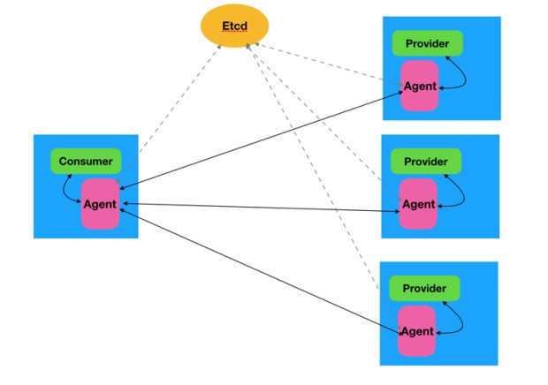

# go-agent

### 项目背景
Apache Dubbo (Incubating) 是阿里中间件团队贡献给 Apache 社区的第二个开源项目，是一款在国内被使用最广泛的服务治理框架。
众所周知，Dubbo 的 RPC 通讯和服务治理能力一直局限在 Java 领域，因此增加多语言支持是建设 Dubbo 生态环境的一个重要方向。
随着微服务及相关技术实践的落地，Service Mesh 已经成为分布式场景下服务化整合的热门解决方案，能够实现服务注册与发现、服务治理和服务监控等多种功能，并与底层设施及周边环境实现了很好的融合，这些都与 Dubbo 的能力如出一辙，未来 Dubbo 将有可能发展成为 Service Mesh 的一种通用解决方案。
作为 Service Mesh 的核心组件之一，高性能的服务间代理（Agent）是不可或缺的，其可以做到请求转发、协议转换、服务注册与发现、动态路由、负载均衡、流量控制、降级和熔断等诸多功能，也是区别于传统微服务架构的重要特征。

### goagent与dubbo的关系

### go-agent描述

1. consumer-agent 需要启动一个http服务器，接收来自consumer的http请求,通过goagent间自定义的协议，将请求转发到provider-agent
2. provider-agent 接收来自consumr-agent的tcp请求，之后模拟dubbo协议，与dubbo进行通信
3. provider-agent 基于etcd集群搭建，启动时注册临时节点到etcd中
4. consumer-agent 通过etcd获取provider-agent集群，采用权重随机的负载均衡算法向provider-agent发送请求

### 项目描述

1. pool文件夹是实现连接池的包{通用}
2. tcp文件夹是实现类似于netty的异步处理tcp的包{通用}
3. registry是基于etcd注册中心的包{不通用}
4. config是go-agent的配置类的包
5. agent是协议转化包，内部有dubbo的协议转化，和agent间的协议

### 项目如何使用
